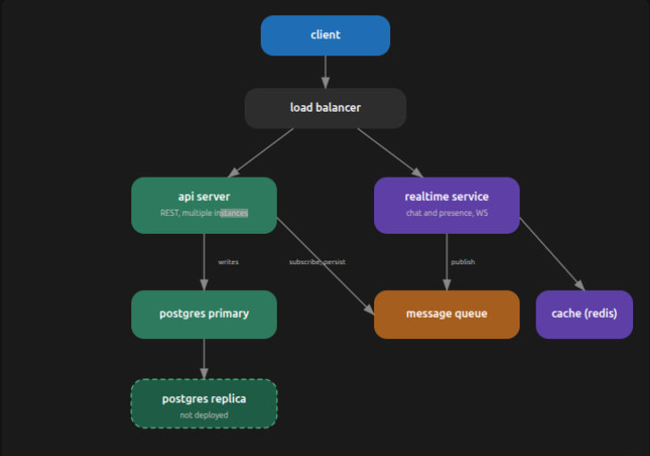
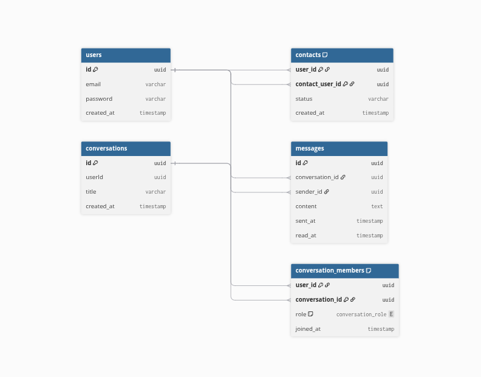
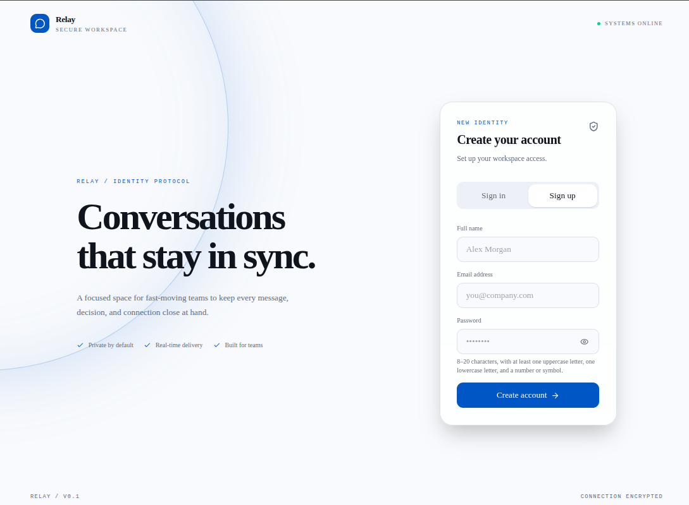
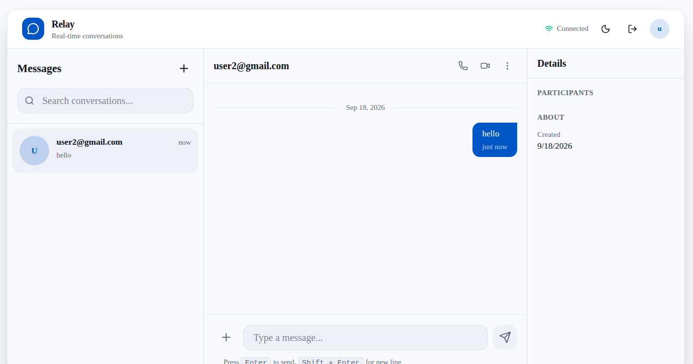

# Chat App

A real-time web chat application: a **Next.js** frontend backed by a **NestJS** monorepo (REST API + Socket.IO realtime service), a **PostgreSQL** data store, and **RabbitMQ** as the message bus between services. A single **HAProxy** instance fronts the backend as the reverse proxy, health endpoint, and per-IP rate limiter.

## Overview

CHAT_APP is a real-time chat application. Its NestJS backend is split into two services: an **API** service that exposes the REST endpoints (authentication, users, conversations, messages, contacts), and a **Realtime** service that handles client connections over Socket.IO.

PostgreSQL stores the persistent data. RabbitMQ is used for asynchronous communication between the backend services, so a message created through the API is forwarded to the Realtime service for immediate delivery to connected clients.

The whole stack is containerized with Docker and runs behind a single HAProxy entry point that routes HTTP traffic to the API service and WebSocket traffic to the Realtime service.

> **Note:** This README and the `docs/` folder describe the **currently implemented** system only. The legacy `Backend/README.md` describes an aspirational design (MongoDB, Redis, presence) that is **not** present in this codebase.

## Features

- **User authentication** — sign-up and sign-in with JWT bearer tokens and bcrypt password hashing.
- **User search** — case-insensitive search for other users by email, with pagination.
- **One-to-one conversations** — create, list, and delete conversations between two users.
- **Messaging** — send text messages that are persisted to PostgreSQL.
- **Message history** — fetch messages per conversation, delete messages, and mark them as read.
- **Real-time delivery** — messages created through the API are pushed instantly over Socket.IO to clients in that conversation.
- **Containerized deployment** — the full backend stack runs via Docker Compose behind a single HAProxy entry point.

## Architecture

The frontend receives data through the API via REST and realtime updates over Socket.IO. When a message is created, the API persists it to PostgreSQL and publishes a `message.created` event to RabbitMQ. The Realtime service consumes the event and pushes it to the connected clients.

```
Frontend
   │
   ▼
API ───────► PostgreSQL
 │
 │ message.created
 ▼
RabbitMQ
 │
 ▼
Realtime Service
 │
 │ Socket.IO
 ▼
Connected Clients
```


## System Design

### Architecture Diagram



### Design Overview

The application is split into a browser client and a backend made of two NestJS services behind a single HAProxy entry point:

- **Frontend (Next.js)** — the browser client. Uses REST against the API and Socket.IO for realtime updates.
- **API service** — handles HTTP: authentication, users, conversations, messages, and contacts. Persists data to PostgreSQL and publishes an event to RabbitMQ when a message is created.
- **PostgreSQL** — the persistent store for all application data.
- **RabbitMQ** — the message bus between the two services. The API publishes `message.created` events on the `chat.events` exchange; the realtime service consumes them from a queue bound to that exchange.
- **Realtime service** — holds the Socket.IO connections, authenticates them with JWT, groups clients into per-conversation rooms, and emits `message:new` to the right room when it receives an event from RabbitMQ.
- **HAProxy** — the only entry point from the browser. Routes HTTP traffic to the API service and Socket.IO/WebSocket traffic to the realtime service, and also provides the `/health` endpoint and per-IP rate limiting.

### Why This Design?

- **Separation of concerns** — HTTP/API logic (auth, validation, persistence) lives in one service and realtime connection handling in another, so each can be developed and tested independently.
- **Persistence stays with the API** — a message is saved to PostgreSQL before any realtime delivery is attempted, so saving a message never depends on whether clients are connected.
- **RabbitMQ decouples production from delivery** — the API only needs to publish an event; it does not need to know which sockets are connected. The realtime service picks the event up asynchronously.
- **Independent evolution** — the realtime layer (new events, different transport, more instances) can change or grow without touching the API.

### Trade-offs

- Five runtime components (API, realtime, HAProxy, RabbitMQ, PostgreSQL) mean more moving parts and operational complexity than a single-service application.
- RabbitMQ is an extra dependency that must be running and healthy for realtime delivery to work.
- The two backend services are decoupled through the message bus, so delivery depends on RabbitMQ being available between them.
- Both HAProxy and the realtime service currently run as single instances; scaling realtime to multiple instances would require additional setup (for example, a shared Socket.IO adapter).

## Database Diagram



The diagram shows the PostgreSQL schema as defined by the TypeORM entities in the API service. It contains five tables — `users`, `conversations`, `messages`, `contacts`, and `conversation_members` — with their columns, primary keys, and foreign-key relationships.

### Key Relationships

- A user sends many `messages` (`messages.sender_id` → `users.id`); each message has exactly one sender.
- A `conversation` contains many `messages` (`messages.conversation_id` → `conversations.id`); each message belongs to at most one conversation.
- A user joins many conversations through `conversation_members` (`conversation_members.user_id` → `users.id`), and a conversation has many members (`conversation_members.conversation_id` → `conversations.id`).
- `contacts` relates one user to another in two ways: as the entry owner (`contacts.user_id` → `users.id`) and as the added contact (`contacts.contact_user_id` → `users.id`).

### Important Constraints

- `conversations.userId` is a plain `uuid` column; it is **not** a foreign key because no ORM relationship is defined for it in the `Conversations` entity.
- `messages.sender_id` is `NOT NULL` and references `users.id` with `ON DELETE CASCADE`, so deleting a user removes their messages.
- `messages.conversation_id` is nullable — a message may exist without a conversation.
- `contacts` uses a composite primary key on (`user_id`, `contact_user_id`).
- `conversation_members` uses a composite primary key on (`user_id`, `conversation_id`).
- `contacts` has two relationships to `users`, distinguished by label: the owner (`user_id`) and the contact (`contact_user_id`).

## Tech Stack

- **Backend:** NestJS (TypeScript), Express, TypeORM, JWT, bcrypt
- **Frontend:** Next.js, React, Tailwind CSS, shadcn/ui
- **Database:** PostgreSQL
- **Messaging & Realtime:** RabbitMQ, Socket.IO, amqplib
- **Infrastructure:** Docker, Docker Compose, HAProxy
- **Testing:** Jest, k6

## Screenshots

### Sign Up



### Chat




## Getting Started

### Prerequisites

- **Docker** with the **Docker Compose** plugin — runs the backend stack (API, Realtime, RabbitMQ, PostgreSQL, HAProxy).
- **Node.js** — runs the frontend (`npm install` / `npm run dev`).

### Clone the repository

```bash
git clone https://github.com/khalil-t/CHAT_APP.git
cd CHAT_APP
```

### Environment configuration

Two `.env` files are involved:

1. **`Backend/.env`** — required to run the backend. There is no example file, so create it yourself and add your own values for the variables used by `docker-compose.yml` and the services:

   - `DB_USER`, `DB_PASS`, `DB_NAME` — PostgreSQL credentials and database name.
   - `RABBITMQ_USER`, `RABBITMQ_PASSWORD` — RabbitMQ credentials.
   - `JWT_SECRET` — secret used to sign access tokens.
   - `DB_HOST`, `DB_PORT`, `TYPEORM_SYNC` — database connection settings (`TYPEORM_SYNC=true` creates the schema automatically, since there are no migrations).

   Never commit real passwords or secrets.

2. **`Frontend/.env`** — already present in the repository:

   ```bash
   NEXT_PUBLIC_API_URL=http://localhost:80/api
   NEXT_PUBLIC_SOCKET_URL=http://localhost:80
   PORT=3000
   ```

   No changes are needed for a standard run.

### Start the application

Backend:

```bash
cd Backend
docker compose up --build -d
```

This starts the API (:3003), Realtime (:3002), HAProxy (:80), RabbitMQ (:5672, management UI :15672), and PostgreSQL.

Frontend:

```bash
cd Frontend
npm install
npm run dev
```

### Verify the application is running

- Backend: `curl http://localhost/health` returns a response from HAProxy.
- Frontend: open `http://localhost:3000`, create an account, and start a conversation.

## Environment

Two `.env` files are used. There is no `.env.example`, so create `Backend/.env` manually with the variables below.

### Backend (`Backend/.env`)

| Variable | Used By | Purpose |
|---|---|---|
| `DB_USER` | API, Docker Compose | PostgreSQL username |
| `DB_PASS` | API, Docker Compose | PostgreSQL password |
| `DB_NAME` | API, Docker Compose | PostgreSQL database name |
| `RABBITMQ_USER` | API, Realtime, Docker Compose | RabbitMQ username |
| `RABBITMQ_PASSWORD` | API, Realtime, Docker Compose | RabbitMQ password |
| `JWT_SECRET` | API, Realtime | Secret for signing and verifying JWT access tokens |
| `DB_HOST` | API | PostgreSQL host |
| `DB_PORT` | API | PostgreSQL port |
| `TYPEORM_SYNC` | API | Set to `true` to auto-create the schema (no migrations are used) |
| `RABBITMQ_HOST` | API, Realtime | RabbitMQ host (default `localhost`) |
| `RABBITMQ_PORT` | API, Realtime | RabbitMQ AMQP port (default `5672`) |
| `JWT_ACCESS_TOKEN_TTL` | API, Realtime | Access token lifetime |
| `FRONTEND_URL` | API, Realtime | Allowed CORS origin (default `http://localhost:3000`) |
| `API_PORT` | API | HTTP port of the API service |
| `REALTIME_PORT` | Realtime | Port of the realtime (Socket.IO) service (default `3002`) |

### Frontend (`Frontend/.env`)

| Variable | Used By | Purpose |
|---|---|---|
| `NEXT_PUBLIC_API_URL` | Frontend | Base URL for API requests (default `http://localhost:80/api`) |
| `NEXT_PUBLIC_SOCKET_URL` | Frontend | Base URL for the Socket.IO server (default `http://localhost:80`) |
| `PORT` | Frontend | Next.js dev server port (default `3000`) |

> Never commit real values for `DB_PASS`, `RABBITMQ_PASSWORD`, or `JWT_SECRET`.

## Running

> TODO: This section will be completed in the next documentation step.

## API

The API is the HTTP side of the backend. It handles account creation and login, user search, conversations, messages, and contacts. All endpoints are exposed under the `/api` prefix and require a JWT bearer token, except the two auth endpoints.

| Method | Endpoint | Purpose |
|---|---|---|
| POST | `/api/auth/sign-up` | Create an account |
| POST | `/api/auth/sign-in` | Log in and receive an access token |
| GET | `/api/users` | Search users by email |
| GET | `/api/users/user` | Get the current user's profile |
| GET | `/api/conversations` | List the current user's conversations |
| POST | `/api/conversations` | Create a conversation with another user |
| GET | `/api/messages?conversationId=` | List messages in a conversation |
| POST | `/api/messages` | Send a message |
| POST | `/api/contacts` | Add a contact |
| PATCH | `/api/contacts/status` | Update a contact's status |

See [docs/api.md](docs/api.md) for the full endpoint reference.

## Realtime

Realtime messaging uses **Socket.IO**. Clients connect to the Realtime service over Socket.IO and receive new messages the moment they are sent.

```
Client
   │
   │ Socket.IO
   ▼
Realtime Service
   ▲
   │
RabbitMQ
   ▲
   │
API
```

- **Connection and auth:** the client authenticates its socket with the same JWT used for the API (sent in the handshake). Connections without a valid token are rejected.
- **Flow:** when a message is created, the API publishes a `message.created` event to RabbitMQ. The Realtime service consumes it and emits `message:new` to the sockets that have joined that conversation's room.

Key events:

| Event | Direction | Purpose |
|---|---|---|
| `conversation:join` | client → server | Join a conversation's room |
| `conversation:leave` | client → server | Leave a conversation's room |
| `message:new` | server → client | A new message in a joined conversation |

See [docs/realtime.md](docs/realtime.md) for the full protocol.

## Load Testing

The project uses [k6](https://k6.io) for HTTP/load testing. Scripts live in `load-tests/` and target the API through HAProxy on port 80.

### Current Tests

- **`auth.js`** — sign-in under load (10 virtual users, 30s), asserting successful login and token issuance.
- **`message.js`** — full message flow: sign-in, fetch the current user, create a message, and list messages.
- **`rate_limiting.js`** — repeated sign-in requests intended to exercise HAProxy's per-IP rate limiting.
- **`health.js`** — health endpoint under high concurrency (1,000 VUs, 10s), asserting `200 OK`.

Each script asserts response expectations with k6 `check`s (HTTP status, presence of the access token, message ID, and similar).

### Run a Test

```bash
k6 run -e BASE_URL=http://localhost:80 load-tests/auth.js
```

`BASE_URL` points at the target host (through HAProxy on port 80).

See [docs/load-testing.md](docs/load-testing.md) for details.

## Project Structure

```
CHAT_APP/
├── Backend/                              # NestJS monorepo (TypeScript)
│   ├── apps/                             # application services
│   │   ├── api/                          # REST API service
│   │   │   └── src/
│   │   │       ├── main.ts               # bootstrap, CORS, global prefix
│   │   │       ├── app.module.ts         # root module, TypeORM + RabbitMQ setup
│   │   │       ├── app.controller.ts
│   │   │       ├── app.service.ts
│   │   │       ├── common/               # configs, decorators, interceptors, socket types
│   │   │       │   ├── config/           # app, database, redis (unused), swagger, jwt
│   │   │       │   ├── decorators/       # @ActiveUser, @Match, @Public
│   │   │       │   ├── interceptors/     # transform interceptor
│   │   │       │   └── socket/
│   │   │       └── modules/              # feature modules
│   │   │           ├── auth/             # sign-up/sign-in, JWT guard, DTOs, bcrypt
│   │   │           ├── user/             # user entity, search/get
│   │   │           ├── conversations/    # one-to-one conversations
│   │   │           ├── message/          # message entity, create/list/delete
│   │   │           ├── contacts/         # contacts CRUD
│   │   │           └── conversation_members/  # member join/leave
│   │   └── realtime/                     # Socket.IO service
│   │       └── src/
│   │           ├── main.ts               # bootstrap, CORS
│   │           ├── realtime.module.ts
│   │           ├── realtime.service.ts
│   │           ├── gateways/             # realtime.gateway.ts (rooms, message:new, JWT auth)
│   │           ├── consumers/            # realtime.consumer.ts (RabbitMQ → Socket.IO)
│   │           └── dto/                  # join-conversation, read-message, typing
│   ├── libs/                             # shared libraries
│   │   ├── common/                       # jwt config, constants, enums, interfaces
│   │   └── infrastructure/
│   │       └── rabbitmq/                 # RabbitMQService (publish/consume), module
│   ├── haproxy/                          # haproxy.cfg (reverse proxy, rate limiting)
│   ├── test/                             # e2e tests (app.e2e-spec.ts)
│   ├── docs/                             # legacy aspirational design (architecture.png)
│   ├── docker-compose.yml                # api, realtime, haproxy, rabbitmq, postgres
│   ├── Dockerfile                        # Node 24 multi-build image
│   ├── nest-cli.json
│   ├── package.json
│   ├── tsconfig.json
│   ├── eslint.config.mjs
│   └── .env                              # local environment variables (not committed)
├── Frontend/                             # Next.js 16 client (React, Tailwind)
│   ├── app/                              # pages (layout.tsx, page.tsx, globals.css)
│   ├── components/
│   │   ├── auth-screen.tsx               # sign-in / sign-up screen
│   │   ├── chat/                         # chat-header, conversation-list, message-list,
│   │   │                                 # message-composer, info-panel, user-discovery...
│   │   └── ui/                           # shadcn/ui components (button)
│   ├── lib/                              # chat-api, chat-socket, chat-context, chat-types
│   ├── public/                           # static assets (icons, placeholders)
│   ├── .env                              # NEXT_PUBLIC_API_URL, NEXT_PUBLIC_SOCKET_URL, PORT
│   ├── package.json
│   ├── next.config.mjs
│   ├── components.json                   # shadcn config
│   └── tsconfig.json
├── load-tests/                           # k6 load tests
│   ├── auth.js                           # sign-in under load
│   ├── message.js                        # message create/list flow
│   ├── rate_limiting.js                  # exercises HAProxy per-IP rate limiting
│   └── health.js                         # health endpoint under high concurrency
├── docs/                                 # detailed technical documentation
│   ├── architecture.md
│   ├── messaging.md
│   ├── realtime.md
│   ├── api.md
│   ├── database.md
│   ├── infrastructure.md
│   ├── load-testing.md
│   └── development.md
├── package.json                          # root JavaScript dependencies
├── package-lock.json
└── README.md
```

## Documentation

Detailed technical documentation lives in the `docs/` directory:

| Document | Contents |
|---|---|
| [docs/architecture.md](docs/architecture.md) | Overall architecture, components, and message flows |
| [docs/messaging.md](docs/messaging.md) | RabbitMQ topology, events, queues, and delivery |
| [docs/realtime.md](docs/realtime.md) | Socket.IO protocol, rooms, and events |
| [docs/api.md](docs/api.md) | REST API reference, auth model, error semantics |
| [docs/database.md](docs/database.md) | PostgreSQL schema and entities |
| [docs/infrastructure.md](docs/infrastructure.md) | Docker Compose, HAProxy, ports, and env vars |
| [docs/load-testing.md](docs/load-testing.md) | k6 scripts and how to run them |
| [docs/development.md](docs/development.md) | Local setup, run/build/test workflow |

## Future Improvements

- **Realtime load testing** — add a k6 scenario that exercises WebSocket/Socket.IO traffic; the current load tests cover only the HTTP API.
- **Typing indicators** — implement typing notifications; the realtime DTOs exist, but no corresponding gateway events are implemented yet.
- **Horizontal scaling of the realtime service** — run multiple realtime instances behind HAProxy with a shared Socket.IO adapter so a single instance is not a bottleneck.
- **More comprehensive automated tests** — add frontend tests and expand backend e2e coverage beyond the current unit and single e2e specs.
- **Monitoring and observability** — add structured logging, metrics, and centralized error tracking; 